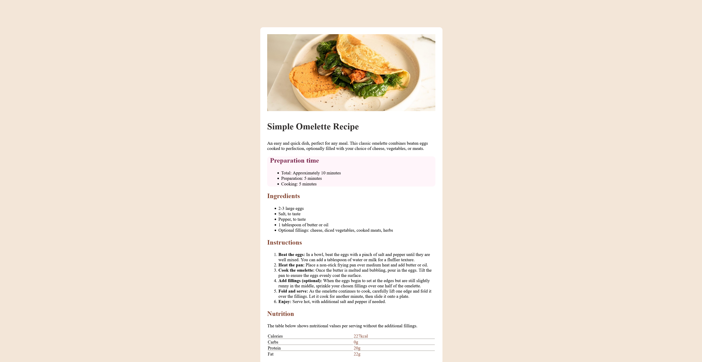

# Frontend Mentor - Recipe page solution

This is a solution to the [Recipe page challenge on Frontend Mentor](https://www.frontendmentor.io/challenges/recipe-page-KiTsR8QQKm). Frontend Mentor challenges help you improve your coding skills by building realistic projects. 

## Table of contents

- [Screenshot](#screenshot)
- [My process](#my-process)
  - [Built with](#built-with)
  - [What I learned](#what-i-learned)
  - [Continued development](#continued-development)
- [Author](#author)


## Screenshot



## My process

### Built with

- Semantic HTML5 markup
- CSS custom properties
- Flexbox

### What I learned

```html

<table>
          <tr>
            <td class="horizontal_rule">Calories</td>
            <td class="nutrition_numbers">227kcal</td>
          </tr>
          <tr>
            <td class="horizontal_rule">Carbs</td>
            <td class="nutrition_numbers">0g</td>
          </tr>
          <tr>
            <td class="horizontal_rule">Protein</td>
            <td class="nutrition_numbers">20g</td>
          </tr>
          <tr>
            <td>Fat</td>
            <td class="nutrition_numbers_bottom">22g</td>
          </tr>
        </table>

```

I learned about tables in HTML

```css
:root {
    --Nutmeg: hsl(14, 45%, 36%);
    --Dark_Raspberry: hsl(332, 51%, 32%);
    --White: hsl(0, 0%, 100%);
    --Rose_White: hsl(330, 100%, 98%);
    --Eggshell: hsl(30, 54%, 90%);
    --Light_Grey: hsl(30, 18%, 87%);
    --Wenge_Brown: hsl(30, 10%, 34%);
    --Charcoal: hsl(24, 5%, 18%);
}
```

I learned about naming colors so that they can be easily reused

### Continued development

In further projects, I will continue using the :root element in css to name frequently used colors

## Author

- Website - [Dirk Mosterd](https://www.dirkmosterd.nl)
- Frontend Mentor - [@Dirk-nl](https://www.frontendmentor.io/profile/Dirk-nl)